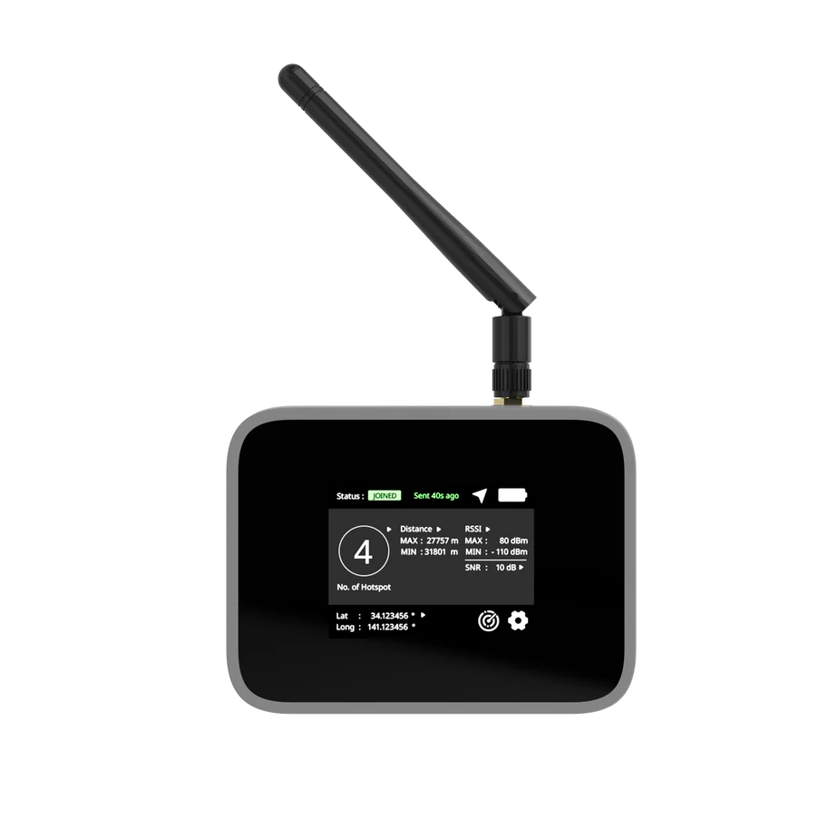
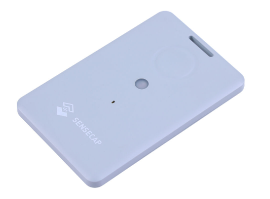
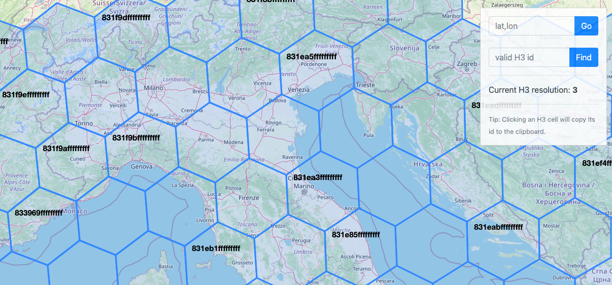
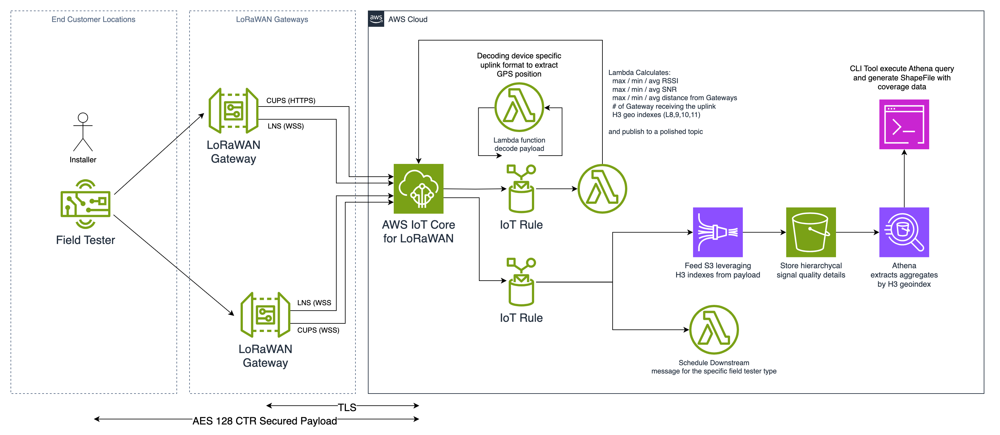
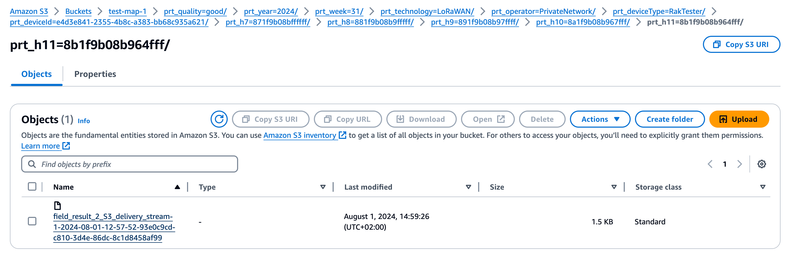
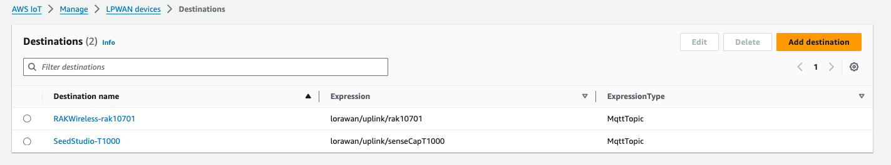
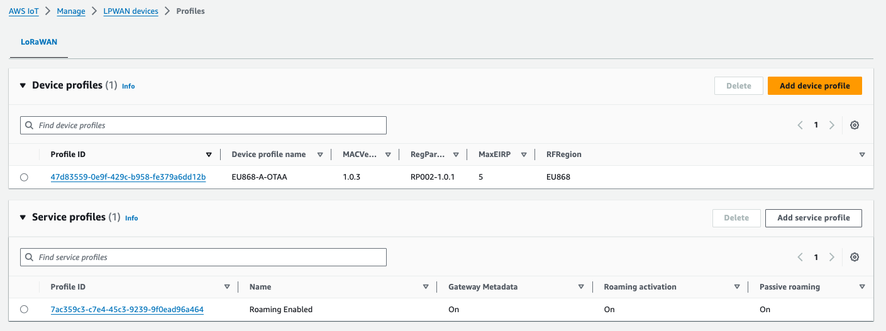
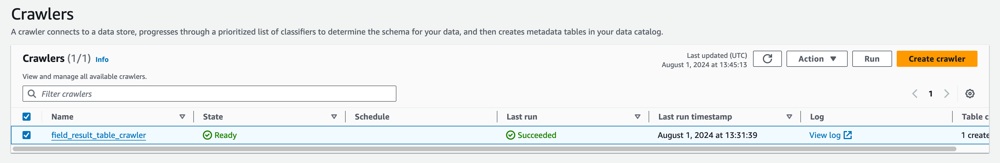
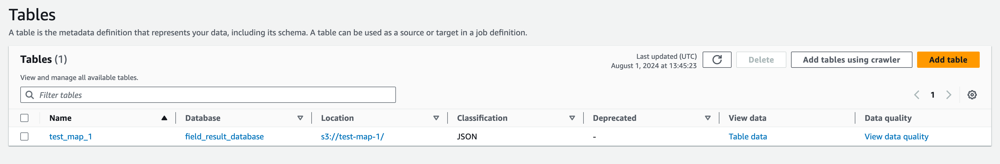
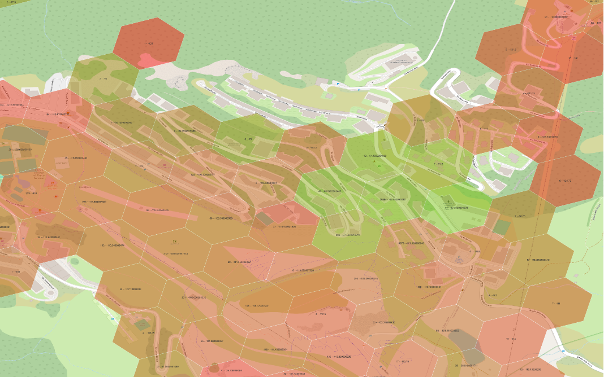

# Coverage Map Calculator for LoRaWAN using AWS IoT Core for LoRaWAN

This is **an example** of how to use a GPS LoRaWAN Tracker or a LoRaWAN Network Tester to perform site surveys and then generate a ShapeFile representing the "coverage map" of your LoRaWAN Network using the H3 geo-indexing library (<https://h3geo.org/>) as an aggregation bounding box.

## Background

When planning to deploy several LoRaWAN devices over a specific area, you need to plan the network coverage upfront. One possible option is relying on propagation models to obtain an estimated coverage map. When you need a reliable source of information with a high level of confidence, you need to execute site surveys.

### LoRaWAN Radio Signals Information

When a LoRaWAN device sends an uplink message, the transmission can potentially be received by multiple LoRaWAN Gateways at a time. The RF frontend of those gateways measures a couple of important Key Performance Indicators (KPIs) to monitor the signal quality: Received Signal Strength Indicator (RSSI) and Signal-to-Noise Ratio (SNR).

The values of the RSSI and SNR can be forwarded together with the payload to a downstream application for analysis.

#### RSSI

RSSI measures the power level of a received radio signal. It provides an indication of the signal strength received by the receiver, typically measured in decibels-milliwatts (dBm). In the context of LoRaWAN, RSSI is used to assess the strength of the signal received by a gateway from an end device. Higher RSSI values indicate stronger signals, while lower values suggest weaker signals. However, RSSI alone does not provide information about the quality of the signal, as it is affected by noise and interference.

#### SNR

SNR is a measure of the signal quality relative to the background noise level. It is the ratio of the signal power to the noise power, often expressed in decibels (dB). In LoRaWAN, SNR is a crucial metric as it indicates the clarity of the received signal. A higher SNR means that the signal is clearer and less affected by noise, while a lower SNR indicates more noise and potentially poorer signal quality. SNR is particularly important in determining the ability to decode the received signal correctly, which is essential for reliable communication.

#### Relationship between RSSI and SNR

While both RSSI and SNR are important in evaluating the performance of a LoRaWAN network, they serve different purposes:

- RSSI provides an indication of the received signal strength, which can help in understanding the coverage area and penetration of the signal.
- SNR provides an indication of the signal quality, which is critical for ensuring reliable data transmission and decoding.

In summary, a strong RSSI with a high SNR is ideal for optimal LoRaWAN communication, as it indicates both strong and clear signal reception.

### LoRaWAN Survey Devices

There are several LoRaWAN Devices that could be used to perform surveys. While with LoRaWAN you can estimate the location of an end device using triangulation mechanisms, to provide an accurate survey, it's better to rely on devices with built-in Global Navigation Satellite System (GNSS) receivers (GPS and other constellations).

The devices integrated into this sample are the following:

#### RAK Wireless RAK10701

[RAK 10701](https://store.rakwireless.com/products/field-tester-for-lorawan-rak10701?variant=43920634544326) is a Field Tester for LoRaWAN which includes a GNSS receiver, the LoRaWAN radio, a display, and a battery.



It sends an uplink message which includes the location and can listen for downlink messages which include the number of Gateways that have received the last uplink and some statistics like the maximum and minimum RSSI and the SNR.

You can change its configuration either from the touchscreen display or with the dedicated application over USB.

#### Seeed Studio SenseCAP T1000 Tracker

The [SenseCAP T1000 Tracker](https://www.seeedstudio.com/sensecap-t1000-tracker) is a compact LoRaWAN Tracker with a built-in GNSS receiver, other sensors, a button, and a battery.



It's small enough to fit into a pocket or a backpack and doesn't require much interaction to send the position recurrently.

It sends an uplink including the position and can receive downlink messages to turn on notifications when needed.

You can change its configuration with a mobile companion app which connects via Bluetooth with the device.

### H3 Geo Indexes

H3 is a "hexagonal hierarchical geospatial indexing system" (<https://h3geo.org/>) from Uber released under the Apache 2.0 License (<https://github.com/uber/h3>).
It consists of a geo-indexing system using a hexagonal grid that can be subdivided into finer hexagonal grids following a hierarchical mechanism.

In a nutshell, providing a coordinate (Lat, Long) and a "Level" (indicating the level of the hierarchy), you can determine an index. That index represents a hexagon in a grid of hexagons with a pre-defined bounding box.
There are online viewers of those hexagon grids like this website: <https://wolf-h3-viewer.glitch.me/>

Here you can see an example of the grid: 

Having a simple way of indexing locations is pretty useful, especially when you want to perform aggregation of information across nearby locations.

During a site survey, you could collect signal quality information (or other relevant parameters like the number of Gateways "in reach") passing by multiple times in the same location while not being on the same exact position (the GNSS precision may vary over time according to the geometry of the satellites in view, especially in a city center!). It is crucial to be able to aggregate those measurements with averages or other statistics to obtain a reliable view of the actual coverage in that area.

Geo Indexes simplify that task by addressing multiple "nearby positions" with a single Index.

An Index that could be used as a **partition key into a data lake**.

## Architecture

Below you can see the overall Architecture:



### Data Flow Description

LoRaWAN Devices send uplink messages which include their position.  
One or more LoRaWAN Gateways receive the transmission and forward it to AWS IoT Core for LoRaWAN.

Each Device type has its own [Destination](https://docs.aws.amazon.com/iot-wireless/latest/developerguide/lorawan-create-destinations.html) assigned, which ultimately is going to trigger the first [AWS IoT Core Rule](https://docs.aws.amazon.com/iot/latest/developerguide/iot-rules.html) to decode the payload with an [AWS Lambda](https://docs.aws.amazon.com/iot-wireless/latest/developerguide/lorawan-destination-rules.html).

As a Rule Action, it will republish the decoded payload into an MQTT topic (`lorawan/decodedUplink/\<Device Type\>/\<Device Id\>`) for troubleshooting and execute another AWS Lambda which is in charge of calculating some statistics like max, min, avg signal strength, and if available, the distance from the receiving gateways (only for private LoRaWAN Networks).
Another important task executed in that Lambda is the calculation of the H3 Geo Indexes at various resolutions starting from the Position reported by the device in the uplink message.

As the last action, the Lambda is republishing the message augmented with the information calculated to another MQTT Topic (`lorawan/fieldSurveyResult/\<Device Type\>/\<Device Id\>`).

When a message is published on that topic, another Rule is triggered which is going to feed an Amazon Data Firehose stream and execute another Lambda which is going to schedule a downlink message when the upcoming message was originated by the RAK Wireless Network Tester.

Data from the Firehose stream is stored in S3 following a partitioning schema that will help to aggregate those measurements by time period, technology (in this case just LoRaWAN, but the data lake structure is already compatible to store also NB-IoT surveys), network operator, device type, id, and geographical index.

An AWS Glue Crawler is pre-configured to scan the data lake and generate the Table that can be queried with Athena to finally render the ShapeFile with the coverage map thanks to a .NET CLI application.

### Summary of MQTT Topics

**`lorawan/uplink/\<Device Type\>`**

Where Devices Uplink message is sent still encoded by AWS IoT Core for LoRaWAN Destination.
A message sent to this topic will trigger the proper AWS IoT Core Rule to decode the payload.

**`lorawan/decodedUplink/\<Device Type\>/\<Device Id\>`**

Where the AWS IoT Core Rule publishes the original message augmented with the Decoded payload.
This is used just for troubleshooting.

**`lorawan/fieldSurveyResult/\<Device Type\>/\<Device Id\>`**

Where the Statistics calculation Lambda will republish the original decoded message augmented with the Statistics and Geo Indexes.
Messages into this topic will trigger the AWS IoT Core Rule that feeds the Amazon Data Firehose stream and executes the Lambda to schedule a downlink message for the Network Analyzer.

### Data Lake Structure

Once a LoRaWAN device sends an uplink message, after being decoded and augmented with some statistics, the data is sent to S3 by Amazon Data Firehose using a specific folder structure to optimize later on the data filtering and aggregation executed with Amazon Athena.

The S3 folder structure follows Apache Hive naming convention to be easily recognized by the AWS Glue Crawler. The Crawler recognizes partitioning thanks to this format, optimizing data retrieval.



This is the example "path" from the picture above:

```
prt_quality=good
prt_year=2024
prt_week=31
prt_technology=LoRaWAN
prt_operator=PrivateNetwork
prt_deviceType=RakTester
prt_deviceId=e4d3e841-2355-4b8c-a383-bb68c935a621
prt_h7=871f9b08bffffff
prt_h8=881f9b08b9fffff
prt_h9=891f9b08b97ffff
prt_h10=8a1f9b08b967fff
prt_h11=8b1f9b08b964fff
```

`prt_quality` represents if the data was properly interpreted or not by Amazon Data Firehose.
In case of an issue, data will be sent to a "bad quality partition".

`prt_year` and `prt_week` are used to partition data by acquisition time.

`prt_technology` right now just contains LoRaWAN, but this would let the data lake structure be compatible eventually with other transmission technologies like NB-IoT and still be able to filter by technology.

Similarly, `prt_operator` would be PrivateNetwork or PublicNetwork according to whether the data was received using your own Gateways or the PublicNetwork roaming.

`prt_deviceType` represents if the data is coming from the RakTester or the SeeedStudio tracker.
Ideally, you can use this to store data also from static, in-field deployed devices (like Smart Meters) to continuously track the network performance over time and filter results according to the device type.

`prt_deviceId` will enable you to filter also on the specific device only.

The `prt_hXX` represent the H3 Geo Indexes from the bigger to the smaller hexagon, allowing you to aggregate data at different region sizes.

## Requirements

- AWS Account
- AWS CLI (>= v.2.17.15) & CDK (>= v.2.150.0)
- AWS IAM User with enough privileges to interact with AWS IoT Core and the other services described in the architecture and create the CDK stack.
- .NET 8.0.105 SDK (to run the mapCreator cli app)
- Docker (>= v.25.0.3 - it's used by the CDK app to build the Lambda)

## Getting Started

Let's start by cloning the repo:

```bash
git clone https://github.com/aws-samples/aws-iot-lorawan-coverage-map-calculator.git
cd aws-iot-lorawan-coverage-map-calculator
cd cdk
```

In that folder, there is the CDK App to deploy the necessary components of the architecture described above, including the Lambda, the AWS IoT Core Rules, and the LoRaWAN destinations, service and device profiles.

> NOTE: the `cdk.json` file contains the context information including the S3 bucket name, the topics, and other parameters used in the CDK app to configure the deployment. REMEMBER to customize the bucket names

```
    "fieldSurveyResultTopicFilter": "lorawan/fieldSurveyResult/+/+",

    "uplinkTopicFilterRAK10701" : "lorawan/uplink/rak10701",
    "decodedDataTopicRAK10701" : "lorawan/decodedUplink/tester/${WirelessMetadata.LoRaWAN.DevEui}",
    
    "uplinkTopicFilterSeedStudioT1000" : "lorawan/uplink/senseCapT1000",
    "decodedDataTopicSeedStudioT1000" : "lorawan/decodedUplink/tracker/${WirelessMetadata.LoRaWAN.DevEui}",
    
    "fieldCoverageDataFirehoseBucketName" : "<your bucket name with the field- data>",
    "deliveryStreamName": "field_result_2_S3_delivery_stream",
    
    "athenaDatabaseName" : "field_result_database" ,
    "athenaTableName" : "field_result_table",

    "athenaQueryResultBuckerName" : "<your bucket name with the field- data>-query-result",
```

If you haven't deployed any CDK stack yet, you need to "bootstrap" it before.
Please follow the instructions you can find [here](https://docs.aws.amazon.com/cdk/v2/guide/bootstrapping.html)

Now you are ready to deploy the CDK stack in your account.

```bash
cdk deploy --all 
```

### Configuring LoRaWAN Devices

Once you deploy the stack, you will find LoRaWAN Destinations, Service Profile, and Device Profile created for you.





You need now to create a LoRaWAN Device and select one of the two pre-defined Destinations according to the device type you are configuring.

Similarly, select the pre-defined Profiles (Device and Service).

When your device is active and connected to the LoRaWAN Network, you should see data flowing on the MQTT topics described above and into the Data Lake.

> NOTE: The configuration of your Gateways is out of the scope of this guide. However, if you are in an area covered by our LoRaWAN Partner Network, you will be able to leverage that network without installing your gateways.

### Configuring the Map Builder Tool

When you have collected data into the data lake with the field-coverage-mapCreator .NET application, you will be able to filter the data from a specific geographical area, device, and time period and generate a ShapeFile representing the Coverage of the LoRaWAN Network.

The CLI application requires a config file called `config.json`.

```json
{
    "AWSProfile": "<your aws profile>",
    "DatabaseName": "field_result_database",
    "TableName": "<field_result_table>",
    "CrawlerName": "field_result_table_crawler",
    "TriggerCrawler": false,
    "OutputS3BucketName": "<your bucket name with the field- data>-query-result",
    "OutputPath": "mapCreator-aggregates",
    "H3Resolution": "h9",
    "ShapeFilePath": "shp/<shapeFileName>",
    "TimeFilter": "prt_year='2024' AND prt_week='28'",
    "DeviceFilter" : "prt_deviceId='<your device id>'",
    "Coordinate": {
        "Longitude": yyy,
        "Latitude": xxx
    }
}
```

`AWSProfile`: If you want to leverage a specific profile while executing the code, you can specify the profile name in this config file, and it will be applied during execution.

`TableName`: It is the name of the table created by the Glue Crawler. It should be similar to the bucket name but with some differences in the special characters.

You can run the Glue Crawler for the first time to let it create the table:





`ShapeFilePath`: The path where the shapefile will be created. Please ensure the folder path exists.

`TimeFilter`: The time filter is optional.

`DeviceFilter`: Device Filter is optional as well. You can add an additional AND clause and add a filter by type if needed.

`Coordinate`: Represents the geo-coordinate you want to use to filter the data using the Geo Indexing partitions to create a map for a specific geographical area.

You can check the code for more details or change it as needed to obtain the exact map useful for your business!

### Executing the Map Builder Tool

Navigate the application code to understand the possible combinations of the applicable filters.

To execute the application, just run:

```bash
dotnet run
```

Under the `ShapeFilePath`, it will create the ShapeFile with the dataset including the statistics aggregated by Hexagon of the GeoIndex resolution you specify in the configuration.

> NOTE: Remember that you need to trigger the crawler first to generate the Table and update the partitioning indexes.

This is an example of the map that the tool can generate:



To visualize such a map overlaid with a base map like this, an open-source GIS software was used (QGIS), but any tool capable of opening ShapeFiles could be used as well.

Under the folder `/qgis/` of this repository, you can find a QGIS Style to show the hexagon shaded according to the signal strength and visualizing the value of the signal strength inside the hexagon.

### Cleanup

To clean up the entities deployed, you can just destroy the CDK Stack with the following command from the `cdk` folder of your local copy of this repository:

```bash
cdk destroy --all 
```

Then you need to delete the LoRaWAN devices you've created.

## Security

See [CONTRIBUTING](CONTRIBUTING.md#security-issue-notifications) for more information.

## License

This library is licensed under the MIT-0 License. See the [LICENSE](LICENSE.md) file.
